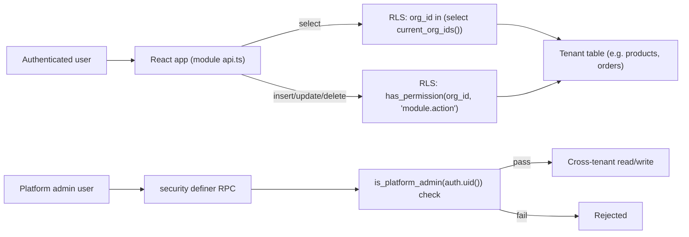

# Tenant Isolation Data Flow

Derived from [docs/03_DATABASE/INDEX.md](../03_DATABASE/INDEX.md), 2026-08-25.

No path exists (and none should ever exist) from a normal tenant-scoped client call to cross-tenant data — the only bypass is the explicit, audited `security definer` RPC layer.
