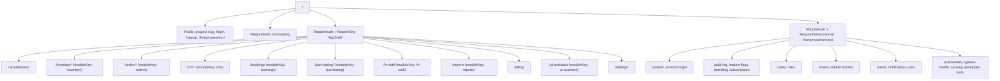

# Route Tree

Derived from `src/router.tsx` and [docs/18_REFERENCE/ROUTE_REGISTRY.md](../18_REFERENCE/ROUTE_REGISTRY.md), 2026-08-25.

```mermaid
flowchart TD
  Root["/"] --> Public["Public: /pages/:slug, /login, /signup, /forgot-password"]
  Root --> Onboard["RequireAuth: /onboarding"]
  Root --> Tenant["RequireAuth + RequireOrg: AppShell"]
  Root --> Platform["RequireAuth + RequirePlatformAdmin: PlatformAdminShell"]

  Tenant --> Dash["/ (Dashboard)"]
  Tenant --> Inv["/inventory* (moduleKey: inventory)"]
  Tenant --> Ord["/orders* (moduleKey: orders)"]
  Tenant --> Crm["/crm* (moduleKey: crm)"]
  Tenant --> Book["/bookings (moduleKey: bookings)"]
  Tenant --> Purch["/purchasing* (moduleKey: purchasing)"]
  Tenant --> Hr["/hr-staff (moduleKey: hr-staff)"]
  Tenant --> Rep["/reports (moduleKey: reports)"]
  Tenant --> Bill["/billing"]
  Tenant --> Ai["/ai-assistant (moduleKey: ai-assistant)"]
  Tenant --> Settings["/settings*"]

  Platform --> Tenants["tenants, tenants/:orgId"]
  Platform --> Ops["audit-log, feature-flags, branding, subscriptions"]
  Platform --> People["users, roles"]
  Platform --> Support["tickets, tickets/:ticketId"]
  Platform --> Content["media, notifications, cms"]
  Platform --> Sys["ai-providers, system-health, security, developer-tools"]
```
